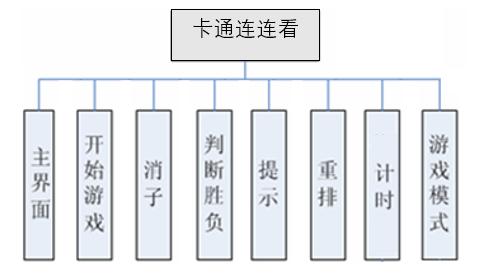
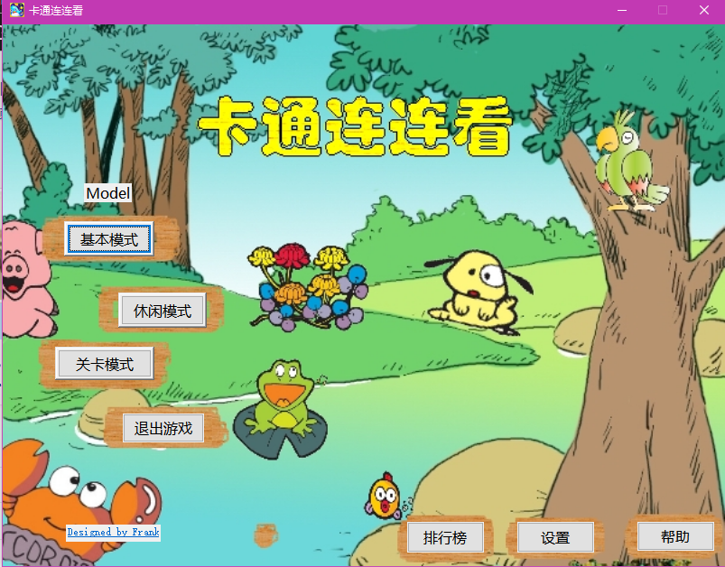
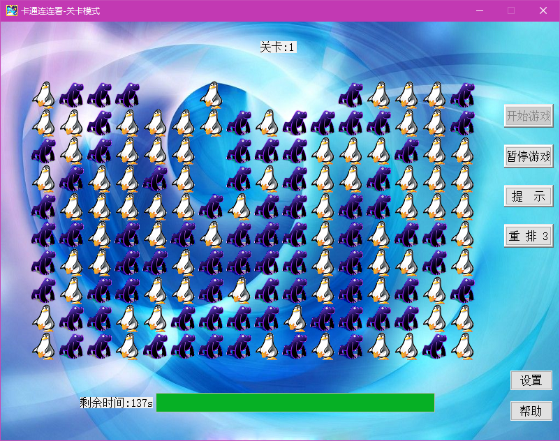
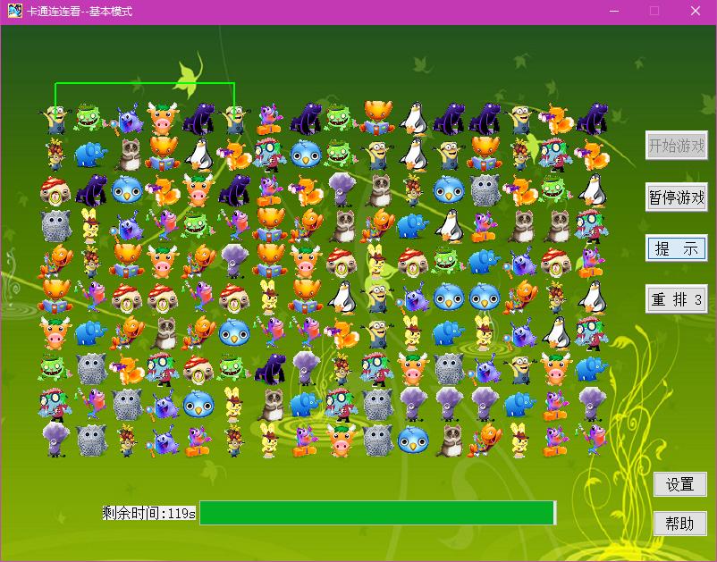
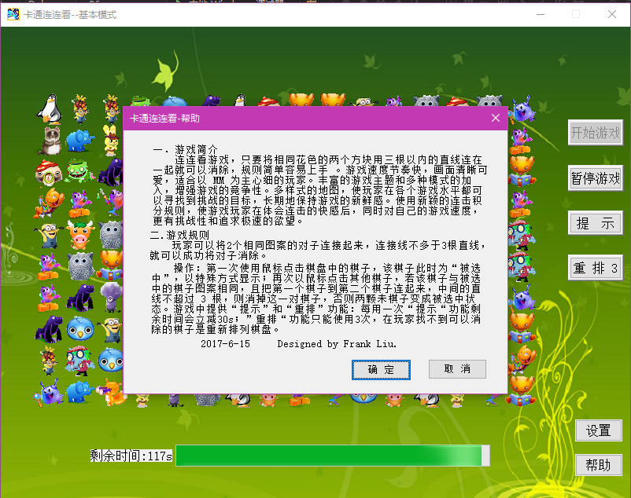
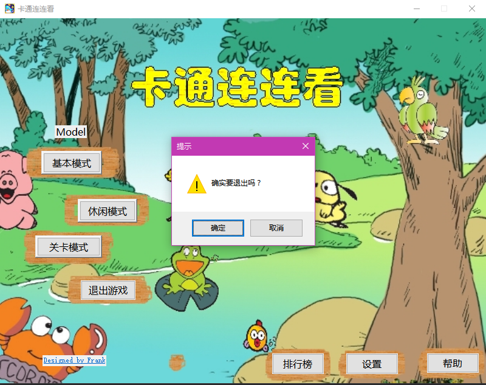

# LLK-MFC

[TOC]

基于MFC的卡通连连看游戏，数据结构与算法综合实验。

待开发连连看游戏，称为“卡通连连看”，使用二维数组来保存游戏地图中的数据，实现了连连看的核心功能。 卡通连连看游戏功能结构图如下：

本项目现在处于作者Frank本人意愿进行OpenSource，提供源码和Windows客户端打包程序发布。
请查看：
* [LLKPro17.6.18](./LLKPro17.6.18)
* [Release](./LLKSetup2.0)

### 功能描述
**（1）主界面**

为游戏主界面，进行各项操作入口。

**（2）开始游戏**

玩家选择游戏模式，进入游戏后，选择开始游戏，系统根据设置的主题风格生成一个图片布局(游戏地图)，以供玩家点击消除。游戏地图大小为640*400，是一个16行 * 10 列矩形，分成160个小正方形，存放160张图片，每张图片大小为40*40。

**（3）消子**

对玩家选中的两个图案进行判断，是否符合消除的规则。只有符合以下条件的图案对才会
消失： 1) 一条直线连通； 2) 两条直线连通； 3) 三条直线连通。如果可以消除，从游戏地图中提示连接路径，然后消除这两种图片，并计算相应的积分。如果不能消除，则保持原来的游戏地图。

**（4）判断胜负**

当游戏完成后，需要判断游戏的胜负。不同模式下，判断胜负的规则不同。
1) 基本模式时，如果在 5 分钟内，将游戏地图中所有的图片都消除，则提示玩家获胜。
2) 休闲模式时，如果游戏地图中所有的图片都被消除，则提示玩家获胜。

**（5）提示**
可以提示界面上能够消除的一对图片。

**（6）重排**
根据随机数，重新排列游戏地图上图片。

**（7）定时**
设定一定时间来辅助游戏是否结束。

**（8）游戏模式**
基本模式、休闲模式和关卡模式三种，可以根据是否定时等规则进行设置，增强趣味性。

### 主界面

### 关卡模式

### 边缘消除提示

### 帮助界面

### 退出游戏
